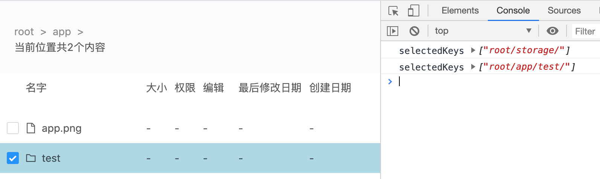

# wangpan
类似百度网盘的一层一层点进去显示该层级文件及文件夹的效果。
这是一个前端项目，用了react，antd。后端只是意思一下。

## 使用
首先
```
cd baidu_server 
npm i && npm start
```
开启node后端服务之后再输入
```
cd baiduyun
npm i && npm start
```
打开localhost:3000

